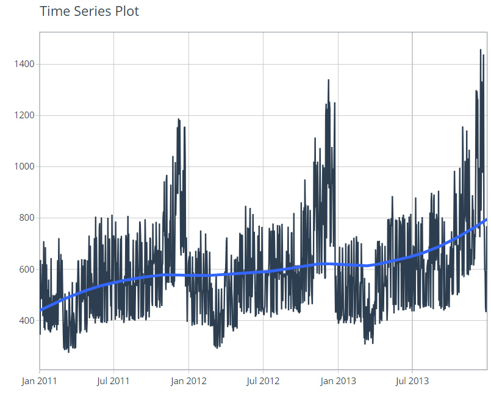
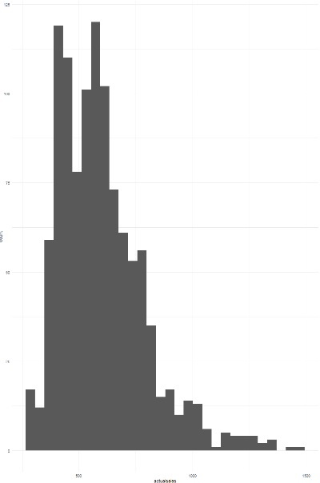
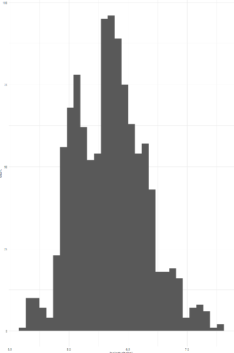
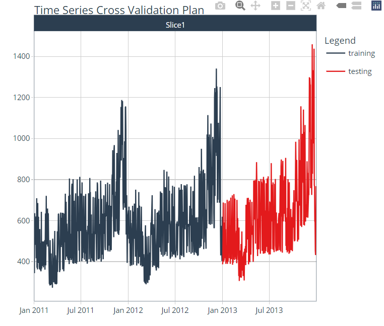
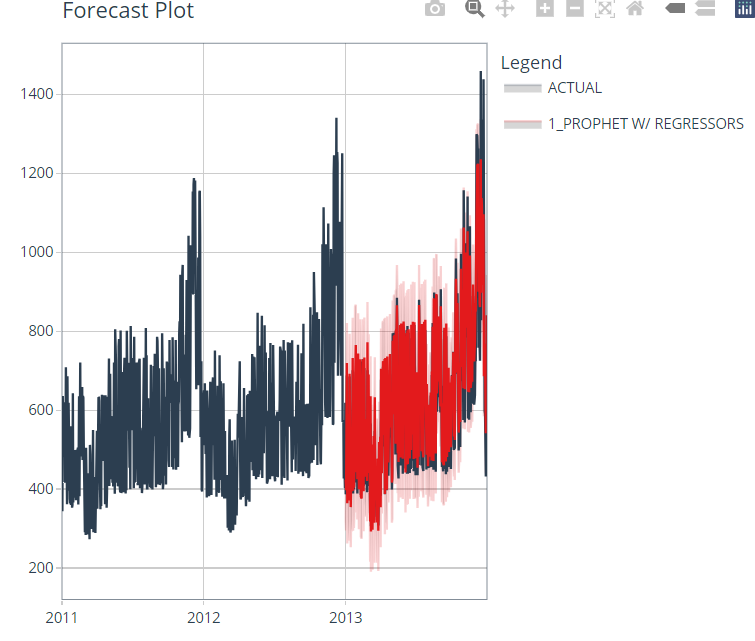

# Product-Sales-Forecasting

### About
The Tidyverse machine learning workflow utilizes various models, including the Prophet package developed by Facebook's Core Data Science team. Prophet is effective at handling time series data trends, accommodating daily, weekly, and yearly seasonality. Trends in time series data reflect patterns of increase or decrease over time and can vary frequently. Prophet is designed to manage changing trends, missing data, and outliers, making it suitable for modeling and forecasting our sales data.

This dataset, featured in Chapter 31 of Wayne L. Winston’s "Marketing Analytics: Data-Driven Techniques with Microsoft Excel," includes three years of daily sales data for Post-it notes.

### EDA

### Factors influencing sales

### Forecast model for sales

### Plotting forecast on test data
